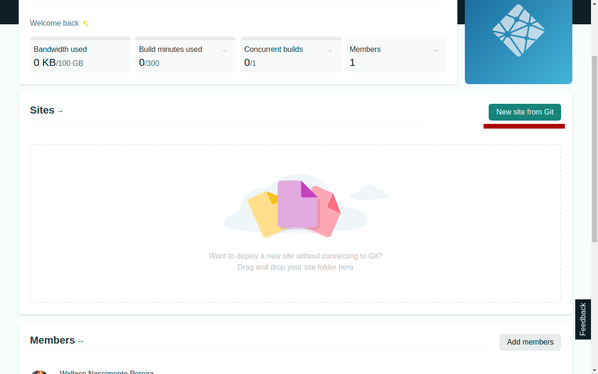
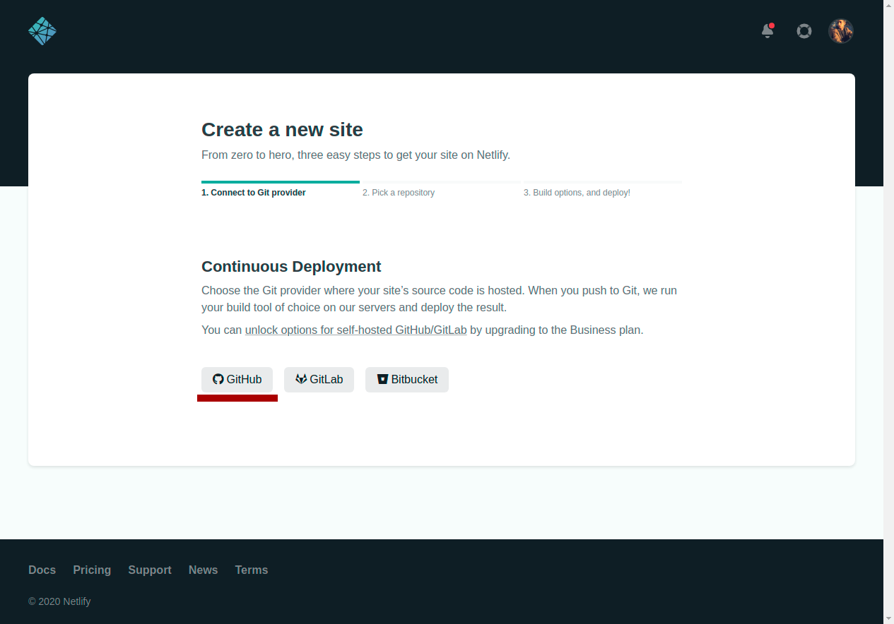

# Deploy on Netlify

Follow the steps:

- Install project dependencies: `yarn create react-app my-app --template=typescript` or `npx create-react-app my-app --template=typescript`;

- Create a netlify.toml file in the root directory of your project `Eg.: my-app/`:

```
    [build]
        base = "/"
        publish = "build/"
    [context.master] ## branch master
        command = "npm run build"
    [[redirects]]
        from="/*"
        to="/index.html"
        status = 200
```
- Push your project into a hosted repository (GitHub, GitLab or Bitbucket);

- Go to netlify site, then create a new site from git:

- Choose your prefered repository host:

- Choose the project and branch that you want to deploy: